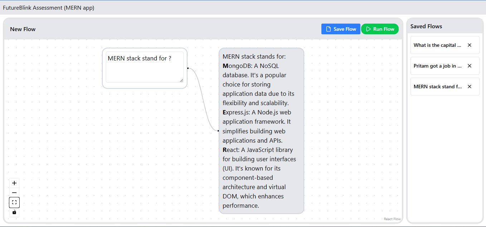

## 🔴 Demo

### 🔴 🖼️ Screenshot

<a href="https://pridebnath.github.io/future-blink-assessment">

</a>


### 🔴 🎥 Video

[Notes - 23-01-2026.webm](https://github.com/user-attachments/assets/8afe9ded-c1a5-4208-9565-64d6343029a0)

⬇️ <a href="frontend/public/demo.webm" download="future-blink-assessment.webm">
  Download Demo Video
</a>


### 🔴 ↗️ Link
https://pridebnath.github.io/future-blink-assessment


---
# Set Up 
## Frontend Set Up
```
cd future-blink-assessment
``` 
```
pnpm install
``` 
```
npm run corepack:enable
``` 
```
cd frontend
``` 
```
npm run dev
``` 
## Backend Set Up
```
cd future-blink-assessment
``` 
```
pnpm install
``` 
```
npm run corepack:enable
``` 
```
cd backend
``` 
```
npm run dev
```
---

#  Docs
## Backend docs
### MongoDB Connection Notes
- DB name comes from `MONGO_URI` from `.env` file (not schema/model)
- No DB in URI → defaults to `test`
- Add DB: `/db-name` before `?`
- Multiple hosts = same cluster (replica set)
- Mongoose pluralizes model → collection
